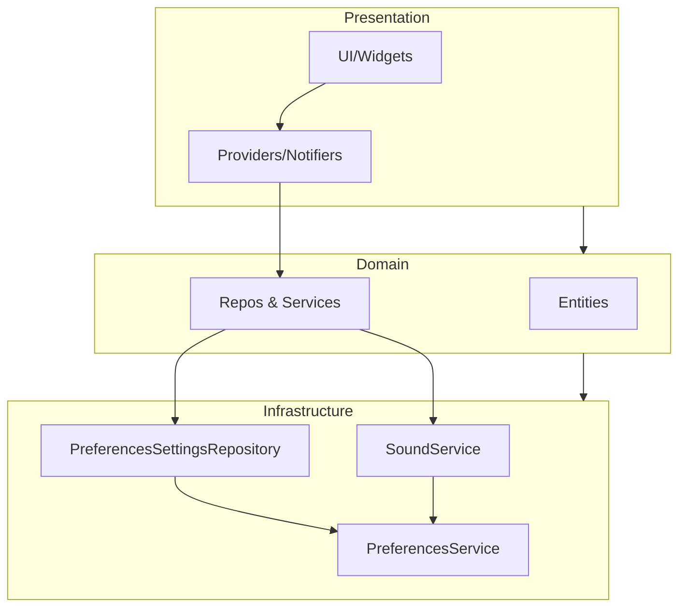

# Arquitectura técnica — Pomodoro App

Última actualización: 2026-02-20

## Resumen
- Objetivo: describir la estructura del proyecto, responsabilidades por capa y guiar cómo extender y probar el sistema.
- Patrón: Arquitectura limpia (Domain / Infrastructure / Presentation). Las dependencias fluyen desde Presentation → Domain → Infrastructure (la capa superior orquesta y compone implementaciones de infraestructura según contratos del dominio).

## Capas y responsabilidades

- Domain (`lib/domain`): entidades, validaciones y contratos (repositorios, servicios). Lógica de negocio pura sin dependencias de Flutter o Riverpod.
- Infrastructure (`lib/infrastructure`): implementaciones de I/O, persistencia, reproducción de audio y adaptadores concretos. No debe depender de Riverpod. Provee clases concretas que implementan los contratos del dominio. (preferences_settings_repository.dart tiene riverpood)
- Presentation (`lib/presentation`): providers, notifiers, UI y composición de dependencias (aquí se crean los providers de Riverpod que inyectan implementaciones de `infrastructure`).

## Componentes clave (archivos y responsabilidad)

- `lib/domain/entities/settings.dart` — Entidad `Settings` con validaciones y `copyWith`.
- `lib/domain/entities/pomodoro.dart` — Entidad `Pomodoro` (estado del temporizador, formato de tiempo, progreso).
- `lib/domain/services/notification_service.dart` — Contrato `NotificationService` (API usada por dominio/presentación para notificaciones/sonido).
- `lib/domain/repositories/settings_repository.dart` — Interfaz `SettingsRepository` (contrato para persistencia de settings).

- `lib/infrastructure/local_storage/preferences_service.dart` — Wrapper sobre `SharedPreferences` para leer/escribir claves.
- `lib/infrastructure/repositories/preferences_settings_repository.dart` — `PreferencesSettingsRepository` implementa `SettingsRepository` usando `PreferencesService`. //error de uso de riverpood...
- `lib/infrastructure/services/sound_service.dart` — Implementación `SoundService` de `NotificationService` (reproducción de `assets/sounds/ding.mp3`).

- `lib/presentation/providers/settings_provider.dart` — `SettingsNotifier` (StateNotifier) que usa `SettingsRepository` y expone `Settings` a la UI.
- `lib/presentation/providers/timer_notifier.dart` — `PomodoroNotifier` que maneja la lógica del temporizador (start/pause/reset/setSession) y llama a `NotificationService` cuando finaliza.
- `lib/presentation/providers/notification_provider.dart` — Provider de presentación que crea/inyecta la implementación concreta `SoundService` (evita Riverpod dentro de infraestructura).
- `lib/presentation/providers/theme_provider.dart` — Notifier para tema/colores, usa `PreferencesService` vía provider infra centralizado.

## Flujo de ejemplo: cambio de duración

1. UI dispara `changePomodoroDuration(minutes)` en `settingsProvider`.
2. `SettingsNotifier` valida/actualiza `state` con la entidad de dominio `Settings` y delega persistencia a `SettingsRepository`.
3. `PreferencesSettingsRepository` escribe el valor en `SharedPreferences` mediante `PreferencesService`.

## Flujo de ejemplo: fin del temporizador

1. `PomodoroNotifier` detecta `remainingSeconds == 0` y cancela el `Timer`.
2. `PomodoroNotifier` llama a `NotificationService.playDing()` a través de `notificationServiceProvider` (presentación).
3. `notificationServiceProvider` expone la implementación `SoundService` en `infrastructure`, que reproduce el asset.

## Decisiones de diseño

- Las entidades de dominio contienen invariantes y validaciones para mantener consistencia (p. ej. rangos de minutos en `Settings`).
- Las abstracciones (repositorios, servicios de notificación) están en `domain` para permitir implementaciones intercambiables en `infrastructure` y facilitar testing.
- Riverpod se usa en la capa `presentation` para inyección y gestión del ciclo de vida; la capa `infrastructure` no debe depender directamente de Riverpod.
- La composición (qué implementación usar) se hace en `presentation` mediante providers, lo que facilita sustituir implementaciones en tests con `overrideWithValue`.

## Cómo extender

- Añadir nueva persistencia (p. ej. SQLite): crear una clase en `lib/infrastructure` que implemente `SettingsRepository` y cambiar el provider en `presentation` para usarla.
- Añadir nuevas notificaciones (vibración, notificación local): añadir métodos al contrato `NotificationService` en `domain` y proporcionar implementaciones en `infrastructure`.
- Extraer casos de uso (recomendado): crear `lib/application/usecases` con clases como `GetSettings`, `UpdateSettings`, `StartSession`, `FinishSession` que orchestren repos/servicios y simplifiquen los notifiers.

## Testing

- Unit tests: entidades (`Settings`, `Pomodoro`) y repositorios (mock `PreferencesService` o usar `shared_preferences` en memoria). Testear validaciones y `copyWith`.
- Tests de integración: widget tests donde se sobreescriben providers (`notificationServiceProvider`, `settingsRepositoryProvider`) para inyectar mocks y verificar comportamiento UI y side-effects.
- Recomendación: en tests, usar `ProviderScope(overrides: [...])` para reemplazar implementaciones concretas por mocks.

## Siguientes pasos recomendados

- Extraer casos de uso en `lib/application/usecases` para separar orquestación de la UI.
- Añadir un diagrama simple en `docs/` (Mermaid) que ilustre dependencias entre capas.
- Añadir un `docs/CONTRIBUTING.md` con cómo ejecutar tests y cómo crear nuevos providers/impls.

## Diagrama (Mermaid)

