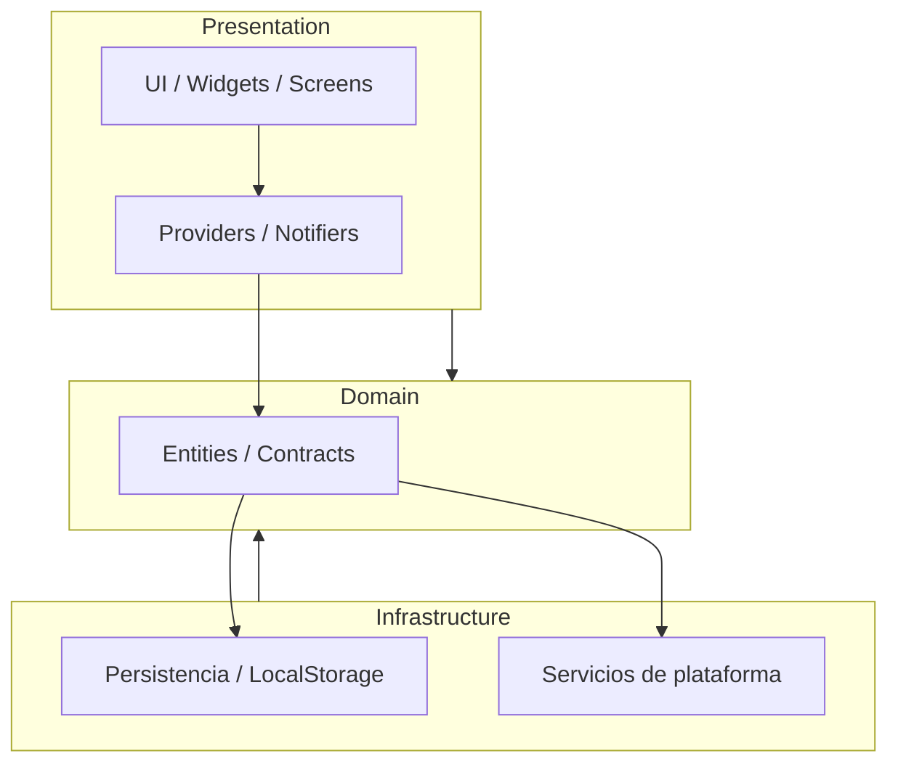

# Arquitectura técnica — Pomodoro App

Última actualización: 2026-02-24

## Resumen
- Objetivo: documentar la estructura del proyecto, responsabilidades por capa y pautas para extender y probar la app.
- Enfoque: capas limpias y modulares que separan la lógica de negocio de las implementaciones de infraestructura y de la UI.

El árbol principal en `lib/` es:

- `lib/config/` — configuración global (p. ej. temas en `lib/config/theme`).
- `lib/domain/` — entidades, contratos (interfaces de repositorios/servicios) y lógica de negocio pura.
- `lib/infrastructure/` — implementaciones concretas (persistencia, acceso a plataforma, reproducción de sonido, adaptadores).
- `lib/presentation/` — UI, providers/notifiers, pantallas y widgets.
- `lib/main.dart` — punto de entrada y composición de dependencias.

## Capas y responsabilidades

- Domain (`lib/domain`): contiene las entidades y los contratos (interfaces) que definen la lógica del dominio. Esta capa debe ser independiente de Flutter y de cualquier framework de inyección.
- Infrastructure (`lib/infrastructure`): implementa los contratos del dominio. Ejemplos: acceso a `SharedPreferences`, repositorios concretos y servicios de sonido. Estas clases interactúan con paquetes de plataforma pero no deberían contener lógica de UI.
- Presentation (`lib/presentation`): contiene los proveedores/notifiers, pantallas y widgets. Aquí se realiza la composición de dependencias (qué implementación usar) y se expone el estado a la UI.

## Ejemplos de archivos y responsabilidades

- `lib/domain/entities/` — modelos de dominio como `Settings` y `Pomodoro` con invariantes y métodos puros.
- `lib/domain/repositories/` — interfaces como `SettingsRepository`.
- `lib/domain/services/` — contratos para servicios de plataforma (p. ej. `NotificationService`).

- `lib/infrastructure/local_storage/` — adaptadores para persistencia (por ejemplo, un wrapper sobre `SharedPreferences`).
- `lib/infrastructure/repositories/` — implementaciones concretas de repositorios (p. ej. `PreferencesSettingsRepository` que implementa `SettingsRepository`).
- `lib/infrastructure/services/` — servicios concretos (p. ej. `SoundService` que reproduce assets desde `assets/sounds/`).

- `lib/presentation/providers/` — notifiers/providers que orquestan casos de uso y llaman a los contratos del dominio.
- `lib/presentation/screens/` y `lib/presentation/widgets/` — UI compuesta a partir de los providers.

## Flujo breve: cambiar una preferencia

1. La UI invoca un método del provider (p. ej. `settingsProvider.updateDuration(...)`).
2. El provider LLAMA LA ENTIDAD PARA valida/transforma los datos usando las entidades del dominio y delega la persistencia a un `SettingsRepository`.
3. La implementación en `lib/infrastructure/repositories/` persiste el cambio (p. ej. mediante `SharedPreferences`) y el provider actualiza el estado expuesto a la UI.

## Flujo breve: fin de sesión (sonido/alerta)

1. El notifier del temporizador detecta que la sesión finalizó.
2. El notifier llama al contrato definido en `lib/domain/services/` (p. ej. `NotificationService`).
3. La implementación en `lib/infrastructure/services/` reproduce el audio o invoca la API de plataforma correspondiente.

## Buenas prácticas y decisiones de diseño

- Mantener la lógica de negocio en `lib/domain` y que dependa sólo de interfaces.
- Implementaciones concretas en `lib/infrastructure` para facilitar pruebas y sustitución (mocks/fakes) en tests.
- Composición de dependencias en el arranque de la app (`lib/main.dart`) o en la capa de `presentation` para poder sobreescribir providers en tests.
- Preferir pequeños casos de uso (use-cases) en una carpeta `lib/application/` si se necesita separar orquestación compleja de los providers.

## Tests

- Unit: probar entidades y casos de negocio en `lib/domain` de forma aislada.
- Integración/Widget: inyectar implementaciones falsas o sobrescribir providers para verificar comportamiento UI y side-effects.

## Cómo extender la app (resumen)

1. Añadir contrato en `lib/domain` (si aplica).
2. Crear entidades o casos de uso en `lib/domain` o `lib/application`.
3. Implementar adaptador en `lib/infrastructure` (p. ej. nuevo repositorio o servicio).
4. Exponer la implementación mediante composición en `lib/main.dart` o en el provider correspondiente en `lib/presentation`.

## Diagrama (Mermaid simple)

